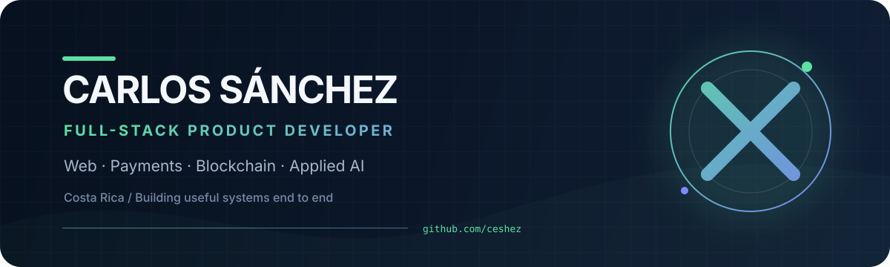

  

  
  
  

## Hola, soy Carlos

Construyo productos web de principio a fin. Mi trabajo reciente vive donde una interfaz clara se encuentra con sistemas que deben hacer cosas reales: **mover pagos, analizar video, publicar sitios, proteger datos y coordinar acuerdos digitales**.

He trabajado con pagos grupales sobre Nimiq, contratos y escrow en Stellar, autenticación con wallets, visión computacional aplicada al fútbol y herramientas no-code para PYMEs. Me gusta entender el flujo completo, convertirlo en una arquitectura manejable y llevarlo hasta una experiencia que alguien pueda usar.

> Mi norte: hacer que la tecnología compleja se sienta simple, verificable y útil.

## Trabajo seleccionado

<table>
  <tr>
    <td width="50%" valign="top">
      <h3>◈ Arka</h3>
      
Pagos grupales con Nimiq: enlaces y QR para invitar, cuatro formas de dividir gastos, contribuciones confirmadas en red y pago final al comercio.

      
<code>React</code> <code>TypeScript</code> <code>Nimiq Pay</code> <code>Supabase</code>

      
<a href="https://github.com/ceshez/arka">Código</a> · <a href="https://arka-nimiq.vercel.app">Demo</a>

    </td>
    <td width="50%" valign="top">
      <h3>◉ DRIVXIS</h3>
      
Plataforma de análisis de fútbol que convierte videos de partidos en información táctica y física mediante un pipeline de procesamiento con YOLO y OpenCV.

      
<code>Next.js</code> <code>Python</code> <code>YOLO</code> <code>PostgreSQL</code>

      
<a href="https://github.com/ceshez/DRIVXIS-Plataforma-de-analisis-de-futbol">Código</a>

    </td>
  </tr>
  <tr>
    <td width="50%" valign="top">
      <h3>✦ GENIO</h3>
      
Constructor visual no-code para que PYMEs y emprendedores creen sitios mediante drag & drop, componentes configurables y persistencia de sus diseños.

      
<code>Next.js</code> <code>Puck</code> <code>Prisma</code> <code>Tailwind CSS</code>

      
<a href="https://github.com/ceshez/ExpoGenio2025">Código</a> · <a href="https://genio-flame.vercel.app">Demo</a>

    </td>
    <td width="50%" valign="top">
      <h3>↗ StelloPay</h3>
      
Experiencia de nómina y pagos con wallet: dashboard tipado, flujos accesibles, autenticación por firma y una API con validación, rate limiting y controles de seguridad.

      
<code>Next.js</code> <code>Express</code> <code>Drizzle</code> <code>Playwright</code>

      
<a href="https://github.com/ceshez/stellopay-frontend">Frontend</a> · <a href="https://github.com/ceshez/stellopay-backend">Backend</a> · <a href="https://stellopay-frontend-gamma.vercel.app">Demo</a>

    </td>
  </tr>
  <tr>
    <td width="50%" valign="top">
      <h3>◇ Thalos</h3>
      
Backend para acuerdos digitales y escrow en Stellar: autorización por participante, disputas, notificaciones y relay seguro hacia Trustless Work.

      
<code>NestJS</code> <code>Stellar</code> <code>Supabase</code> <code>Swagger</code>

      
<a href="https://github.com/ceshez/ThalosBackend">Código</a>

    </td>
    <td width="50%" valign="top">
      <h3>◌ Wrapped Pi</h3>
      
Contratos Soroban y diseño operativo para un token puente en Stellar, incluyendo tooling y documentación para pruebas de reserva firmadas.

      
<code>Rust</code> <code>Soroban</code> <code>Stellar</code> <code>Node.js</code>

      
<a href="https://github.com/ceshez/Wpi">Código</a>

    </td>
  </tr>
</table>

## Colaboración y código abierto

También construyo dentro de repos compartidos. Mis pull requests públicos muestran trabajo en producto, infraestructura, pruebas e integraciones blockchain:

| Ecosistema | Aporte |
|---|---|
| **Thalos Infrastructure** | Suite end-to-end para validar la integración completa con Trustless Work. [Ver PR →](https://github.com/Thalos-Infrastructure/ThalosBackend/pull/108) |
| **StelloPay** | Persistencia de navegación móvil y modo dry-run para migraciones del backend. [Frontend →](https://github.com/Stellopay/stellopay-frontend/pull/668) · [Backend →](https://github.com/Stellopay/stellopay-backend/pull/146) |
| **Pi DeFi / Wpi** | Scripts reproducibles para desplegar contratos en Stellar. [Ver PR →](https://github.com/Pi-Defi-world/Wpi/pull/53) |
| **IDIO** | Recibos y verificación de transacciones, i18n y refactor del flujo de autenticación. [Ver trabajo →](https://github.com/josueazc/IDIO/pulls?q=is%3Apr+author%3Aceshez) |
| **Velar** | Conexión de wallet, unificación del login, mejoras visuales, reintentos de API y orquestación del entorno local. [Ver trabajo →](https://github.com/Velar-Bonds/Velar/pulls?q=is%3Apr+author%3Aceshez) |
| **StarShop** | Integración del contrato de escrow para pagos del marketplace. [Ver PR →](https://github.com/StarShopCr/StarShop-Frontend/pull/316) |

## Mi caja de herramientas

  
  
  
  
  
  
  

  
  
  
  
  
  
  

**Dominios que estoy explorando y construyendo:** Stellar/Soroban, Nimiq, Starknet, contratos inteligentes, pagos digitales, visión computacional, sistemas no-code y experiencias web accesibles.

## Cómo trabajo

1. **Empiezo por el recorrido real.** Antes de elegir herramientas, defino quién usa el producto, qué intenta completar y dónde puede fallar.
2. **Construyo cortes verticales.** Conecto interfaz, API, datos e integración externa temprano para validar el sistema completo.
3. **Hago explícitos los límites.** Tipos, esquemas, DTOs, permisos y estados de error forman parte del diseño, especialmente cuando hay dinero o identidad.
4. **Verifico antes de entregar.** Type-checking, lint, pruebas unitarias/E2E y builds reproducibles acompañan el desarrollo.
5. **Documento decisiones, no solo comandos.** Dejo arquitectura, contratos, riesgos y próximos pasos visibles para que el proyecto pueda seguir creciendo.

## Cómo soy como desarrollador

Soy curioso entre disciplinas y práctico al construir. Puedo pasar de pulir una interacción responsive a diseñar un flujo de firma con wallet o un worker de visión computacional, pero mantengo el mismo criterio: **claridad para la persona, límites seguros para el sistema y una ruta concreta hacia producción**.

También me interesa crear desde Costa Rica para problemas cercanos: herramientas accesibles para negocios, experiencias financieras más comprensibles y productos que conviertan datos complejos en decisiones útiles.

## Hablemos

Si estás trabajando en un producto web, pagos digitales, blockchain aplicada o una idea que necesite bajar de concepto a sistema, puedes encontrarme aquí:

  <a href="mailto:carlossanchezher10@gmail.com"><strong>carlossanchezher10@gmail.com</strong></a>
  &nbsp;·&nbsp;
  <a href="https://github.com/ceshez"><strong>github.com/ceshez</strong></a>

Diseñado y mantenido por Carlos Sánchez · Costa Rica
